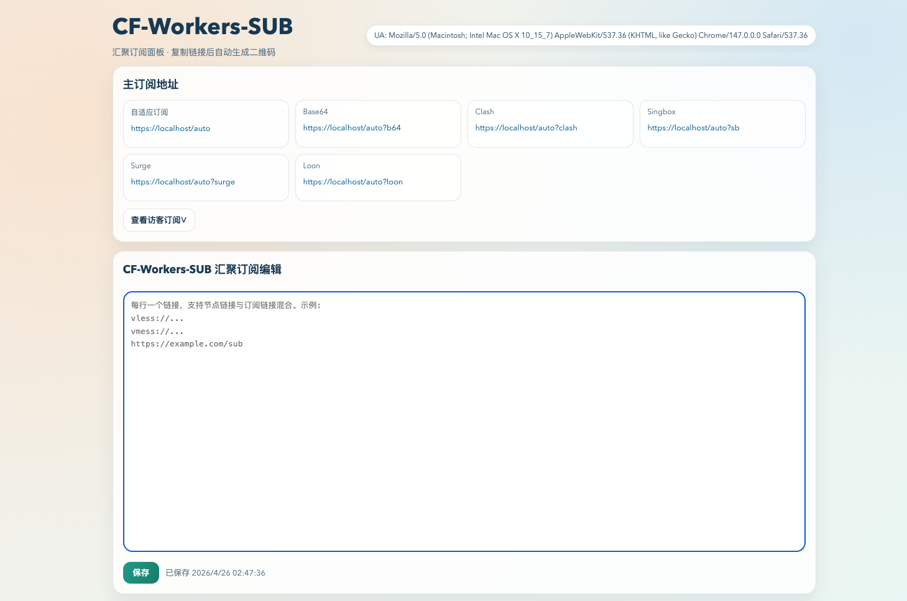

# ⚙ 自建汇聚订阅 CF-Workers-SUB

[English](./README.md) | 中文

这是一个将多个节点和订阅合并为单一链接的工具，支持自动适配与自定义分流，简化了订阅管理。

> [!CAUTION]
> **汇聚订阅非 base64 订阅时**，会自动生成一个**有效期为 24 小时的临时订阅**，并提交给**订阅转换后端**完成格式转换，可避免汇聚订阅地址泄露。

> [!WARNING]
> **汇聚订阅非 base64 订阅时**，如果节点数量过大，订阅转换后端处理时间会明显增加，部分客户端更新订阅时可能超时。

## 🛠 功能特点
1. **支持 AnyTLS 协议**（`anytls://`）
2. **节点链接自动转换成 base64 订阅链接**
3. **将多个 base64 订阅汇聚成一个订阅链接**
4. **自动适配不同客户端格式订阅链接**（依托 [订阅转换](https://sub.cmliussss.com/)）
5. **支持自定义代理分流规则**

## 🔧 AnyTLS 补丁说明
针对 AnyTLS，本项目已做以下补丁处理：

1. **Clash 配置字段修正**
   - 自动把 `fingerprint` 修正为 `client-fingerprint`。
2. **AnyTLS 必填字段自动补齐**
   - 自动补齐 `udp: true`、`alpn: [h2, http/1.1]`、`skip-cert-verify`。
3. **兼容两类 Clash 节点写法**
   - 同时兼容块状写法与行内 map 写法（如 `- {name: ..., type: anytls, ...}`）。
4. **订阅转换失败时的 AnyTLS 回退**
   - 当 `clash` 订阅转换失败时，会从 `anytls://` 链接直接构建可用的 Clash YAML。
5. **附带通用 Clash 修复**
   - 自动把 `url-test` 探测地址修正为 `https://www.gstatic.com/generate_204`。
   - 缺失 `dns` 配置时自动补齐基础 DNS 段，提升开箱可用性。

## 此项目 forked from cmliu/CF-Workers-SUB

## 📦 Pages 部署方法
1. 在 GitHub Fork 本项目。
2. 在 Cloudflare Pages 中 `连接到 Git`，选择项目并完成部署。
3. 在 Pages 里绑定自定义域（建议子域名，如 `sub.example.com`）。
4. 添加环境变量 `TOKEN`（默认 `auto`），订阅入口为：
   - `https://你的域名/auto`
5. 绑定变量名为 `KV` 的 KV 命名空间。
6. 访问订阅入口，逐行填写节点链接与订阅链接。

## 🛠 Workers 部署方法
1. 在 Cloudflare Workers 新建 Worker。
2. 将 [`_worker.js`](./_worker.js) 内容粘贴到编辑器并部署。
3. 修改订阅入口 token（代码内 `mytoken` 或环境变量 `TOKEN`）。
4. 绑定变量名为 `KV` 的 KV 命名空间。
5. 访问订阅入口，逐行填写节点链接与订阅链接。

## 📋 变量说明
| 变量名 | 示例 | 必填 | 备注 |
|-|-|-|-|
| TOKEN | `auto` | ✅ | 汇聚订阅路径，如 `/auto` |
| GUEST | `test` | ❌ | 访客订阅 token，如 `/sub?token=test` |
| LINK | `anytls://...` / `vless://...` / `vmess://...` / `https://...` | ❌ | 多个链接用换行分隔（绑定 `KV` 后通常不使用） |
| TGTOKEN | `6894...` | ❌ | Telegram 机器人 token |
| TGID | `6946...` | ❌ | Telegram 接收通知的用户/群组 ID |
| SUBNAME | `CF-Workers-SUB` | ❌ | 订阅名称 |
| SUBAPI | `SUBAPI.cmliussss.net` | ❌ | 订阅转换后端 |
| SUBCONFIG | `https://raw.githubusercontent.com/...ini` | ❌ | 订阅转换配置文件 |

## ⚠️ 注意事项
如需 Telegram 通知，请先创建 Bot 获取 `TGTOKEN`，并获取接收方 `TGID`。

## 🙏 致谢
原作者：[cmliu](https://github.com/cmliu)

[Alice Networks LTD](https://alicenetworks.net/)、[mianayang](https://github.com/mianayang/myself/blob/main/cf-workers/sub/sub.js)、[ACL4SSR](https://github.com/ACL4SSR/ACL4SSR/tree/master/Clash/config)、[肥羊](https://sub.v1.mk/)
